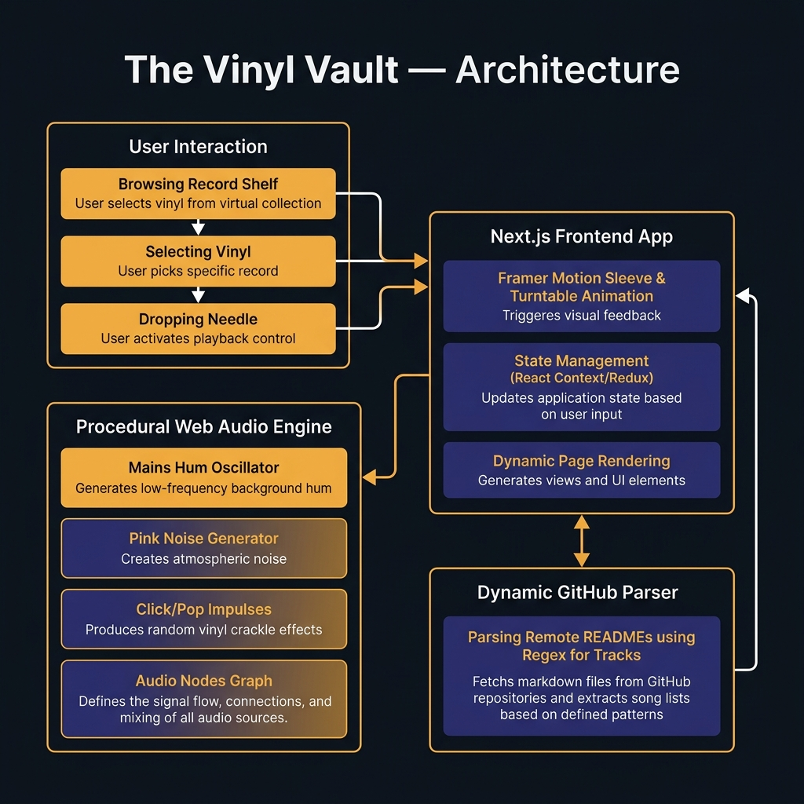
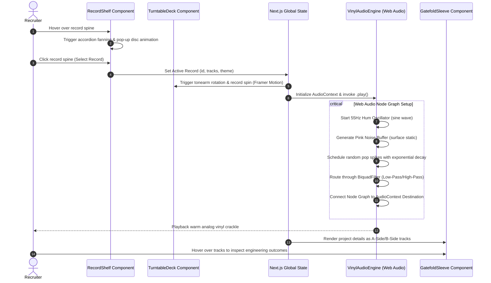

# The Vinyl Vault — Procedurally Audio-Synthesized Interactive Portfolio

[](https://nextjs.org/)
[](https://tailwindcss.com/)
[](https://www.framer.com/motion/)
[](https://developer.mozilla.org/en-US/docs/Web/API/Web_Audio_API)

An interactive, high-fidelity digital record player room showcasing engineering projects as playable vinyl releases. Designed to replace static text-based resumes with an immersive, tactile, and responsive portfolio experience.

🎥 **Live Portfolio Platform**: [yashvardhankhanna-portfolio.vercel.app](https://yashvardhankhanna-portfolio.vercel.app/)

---

## 📌 Problem Statement & Engineering Justification

Standard developer portfolios and resumes are static, non-interactive, and fail to demonstrate real-time client-side performance tuning. Recruiter engagement is low when scanning generic grids of text.

### The Solution: An Interactive Audio-Synthesized Dashboard
The Vinyl Vault solves this by modeling a vintage hi-fi console:
- **Interactive Record Rack**: Multi-category record sleeves utilizing Framer Motion accordion fanning, physical disc ejection, and drag-and-drop turntable physics.
- **Procedural Audio Synthesis**: Bypasses heavy static MP3 assets. Synthesizes authentic vinyl surface noise, mains hum, and stylus pops entirely in real-time using Web Audio API nodes.
- **Dynamic Repository Parsing**: Includes an ETL-like parser utility that dynamically ingests raw GitHub API metadata and README markdown, converting code repositories into structured "A-Side/B-Side" vinyl tracks.

---

## 📐 System Architecture & Data Flow

### Core Architecture

<p align="center">
  
</p>

### Interactive Playback Lifecycle



---

## ⚡ Procedural Audio Synthesis Engine

The application synthesizes vintage vinyl sound effects procedurally, avoiding network requests for heavy audio files:

1. **Amplifier Mains Hum**: An oscillator node generating a continuous 55Hz (A1 frequency) sine wave at very low volume (`gain = 0.005`) to simulate vintage tube amplifier warmth.
2. **Vinyl Surface Static**: A pink noise generator approximated inside a custom 4-second audio buffer. Output is filtered by a low-pass biquad node to isolate low frequencies, mimicking physical stylus-to-groove friction:
   $$\text{pink}[i] = (\text{lastOut} + (0.02 \times \text{white})) / 1.02$$
3. **Stylus Dust Pops**: Random impulse spikes generated at a density rate of $0.00015$ per sample, shaped by an exponential decay envelope to simulate the physical stylus settling after striking a dust particle:
   $$\text{amplitude}[i] = A \times e^{-t \times 0.3}$$

All nodes are connected to a master gain node with smooth linear ramps (`linearRampToValueAtTime`) to prevent pop clicks when dropping or lifting the needle.

---

## 📂 Codebase Structure & Clean Layout

The project structure is organized to isolate presentation logic from utilities:

```
vinyl-vault/
├── app/                        # Next.js App Router Entrypoint
│   ├── layout.js               # Global layouts & metadata
│   ├── page.js                 # Primary landing layout & state coordinator
│   └── globals.css             # Tailwind v4 directives & root animations
├── components/                 # Modular Presentation Layers
│   ├── RecordShelf.js          # Interactive horizontal vinyl rack (accordion fan)
│   ├── TurntableDeck.js        # Tonearm physics & spinning record graphics
│   ├── GatefoldSleeve.js       # Dynamic repository details (A-Side/B-Side tracks)
│   ├── ExperiencePanel.js      # Certifications, credentials & education panels
│   ├── AmbientBackground.js    # Glowing grid overlays
│   └── Preloader.js            # Initial console system boot sequence
├── data/
│   └── vault.js                # Central JSON project specs & credentials database
├── utils/
│   ├── audioSynthesizer.js     # Web Audio API procedural synthesis engine
│   └── githubParser.js         # Automated README/API to vinyl record converter
├── public/                     # Static assets (Resume, Favicon, icons)
├── docs/                       # Architecture diagrams & media
└── LICENSE                     # MIT License
```

---

## 🛠️ Quickstart & Local Execution

### Prerequisites
- Node.js (v18.0.0 or higher)
- npm or yarn

### Installation

1. Clone the repository:
   ```bash
   git clone https://github.com/YashK3086/vinyl-vault.git
   cd vinyl-vault
   ```

2. Install dependencies:
   ```bash
   npm install
   ```

3. Run the development server:
   ```bash
   npm run dev
   ```
   Open [http://localhost:3000](http://localhost:3000) to view the application.

4. Build the production application bundle:
   ```bash
   npm run build
   ```

---

## 📐 Key Optimizations & Recruiter Checklist

- **SSR-Safe Web Audio**: Audio nodes are strictly guarded against server-side rendering execution (`typeof window !== "undefined"`), ensuring clean hydration.
- **Framer Motion Orchestration**: Framer Motion components utilize GPU-accelerated transform operations (`scale`, `rotate`, `y`) to maintain 60 FPS transitions during heavy fanning animations.
- **Tailwind CSS 4**: Implements Tailwind's modern `@tailwindcss/postcss` compiler for faster, leaner production CSS bundles.
- **Strict Linting**: Configured with ESLint and JSConfig for clean code quality and strict import paths.
